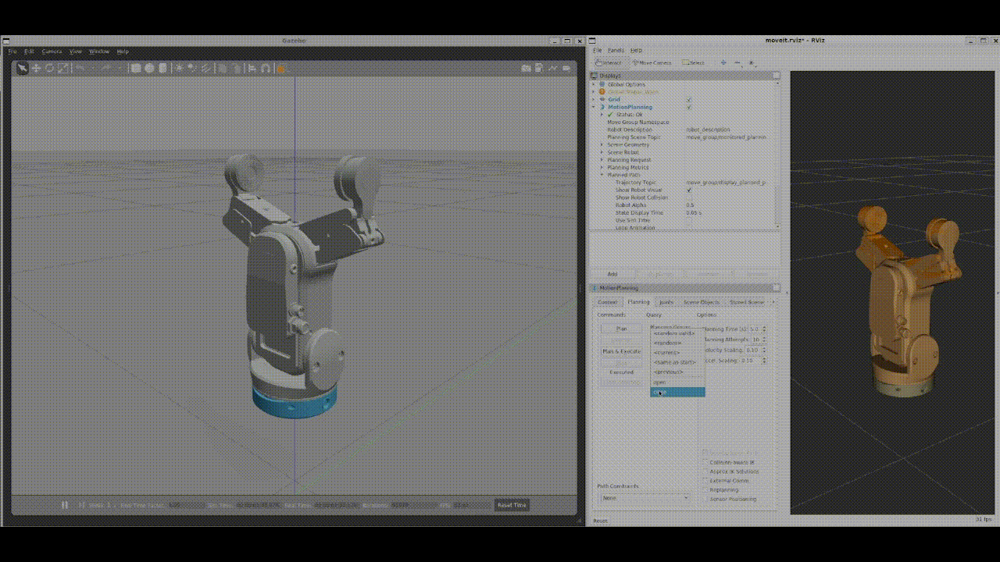

# OnRobot-RG2FT-ROS

This repository contains an unofficial ROS driver for the OnRobot RG2-FT Gripper. The driver enables you to control and monitor the gripper's state through publisher and subscriber interfaces. Additionally, a gripper action server is provided, which can be integrated with MoveIt for motion planning.

The OnRobot RG2-FT Gripper is equipped with force torque sensors and proximity sensors on its fingertips. This driver reads and publishes this sensor data as ROS messages.

**Gazebo and MoveIt of Gripper:**


*Caption: Simulation of the gripper in Gazebo and controlled using MoveIt.*

**Moving the Real Gripper:**


*Caption: Actual OnRobot gripper being controlled through ROS.*

## Features

- ROS support for controlling the OnRobot RG2-FT Gripper.
- Force torque and proximity sensor data available as ROS messages.
- Included URDF with visual and collision meshes, along with Gazebo simulation support.
- Example MoveIt configuration with Gazebo integration.
- Gazebo implementation features a realistic 4-bar linkage simulation for parallel gripper tips.

## Compatibility

This driver has been tested on ROS Noetic.

## Installation

1. Install the main Python dependency, pymodbus version 2.1.0, using the following command:

    ```
    pip3 install pymodbus===2.1.0
    ```

2. Clone this repository and the optional mimic joint plugin repository:

    ```
    git clone https://github.com/ian-chuang/OnRobot-RG2FT-ROS.git

    # Optional: If you want to control both fingers in Gazebo using mimic joint plugin
    git clone https://github.com/roboticsgroup/roboticsgroup_upatras_gazebo_plugins.git
    ```

3. Navigate to your ROS workspace's source directory and install dependencies:

    ```
    cd ~/<your_workspace>/src
    rosdep install -y --from-paths . --ignore-src --rosdistro ${ROS_DISTRO}
    ```

4. Build the workspace:

    ```
    cd ~/<your_workspace>
    catkin build
    ```

## Usage

You have multiple options to control and visualize the real, simulated, and fake versions of the gripper:

- **Control Real Gripper with Publisher-Subscriber Interface:**

    ```
    roslaunch onrobot_rg2ft_control onrobot_rg2ft_control.launch ip:=<gripper_ip defaults to 192.168.1.1> port:=<port defaults to 502>
    ```

- **Control Real Gripper with Gripper Action Server:**

    ```
    roslaunch onrobot_rg2ft_action_server onrobot_rg2ft_action_server.launch ip:=<gripper_ip defaults to 192.168.1.1> port:=<port defaults to 502>
    ```

- **Control Real Gripper with MoveIt:**

    ```
    roslaunch onrobot_rg2ft_action_server onrobot_rg2ft_moveit.launch ip:=<gripper_ip defaults to 192.168.1.1> port:=<port defaults to 502>
    ```

- **Control Simulated Gripper in MoveIt within Gazebo:**

    ```
    roslaunch onrobot_rg2ft_moveit_config demo_gazebo.launch
    ```

- **Control Fake Demo Gripper in MoveIt:**

    ```
    roslaunch onrobot_rg2ft_moveit_config demo.launch
    ```

- **Visualize Gripper URDF in RViz:**

    ```
    roslaunch onrobot_rg2ft_description display.launch
    ```

## Contribution

If you encounter any issues or have suggestions for improvements, please report them. Contributions and updates for compatibility with different ROS versions are welcome. Feel free to fork the repository, make changes, and submit pull requests. Your contributions will be greatly appreciated.